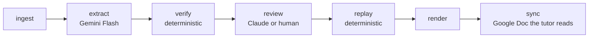

# tutor-memory

Evidence-gated learner memory for an LLM tutor.

## The problem

A chat-based tutor (a Gemini Gem, a custom GPT, anything stateless between
chats) forgets how a given learner learns as soon as the chat ends. The usual
fix is to ask the model to summarize the conversation and carry that summary
forward. That produces confident, unverifiable claims: the model can assert
"the learner prefers visual explanations" with no way to check it against
what the learner actually said. tutor-memory keeps a learner profile instead,
where every claim traces back to a verbatim quote from the learner, and a
claim enters the profile only when a deterministic rule allows it. Models
propose; a fixed rule decides.

## How it works



Who does what:

| Actor | Role |
|---|---|
| Gemini Flash | Cheap, high-volume extraction: read one session transcript, propose observations with quotes. |
| Claude (or a human) | Judgment: is a claim broader than its quotes, is the observation kind right, which existing instruction or hypothesis it matches. |
| Code | The two gates: every quote must exist in a learner turn (`verify`), and the evidence rule decides what enters the profile (`replay`). |

The core rule: models only propose observations and decisions. Nothing a
model writes is state. The profile (`state/profile.json`) is always
recomputed from scratch, in session order, from the approved decision files.
There is no in-place edit of learner state anywhere in the pipeline.

## Automatic mode

In automatic mode, the learner only studies. The [capture extension](extension/README.md) writes
finished Gemini chats to a local inbox, launchd runs `tutormem auto` every 15 minutes, Claude's
review is applied automatically, and the resulting brief is replayed, rendered, and synced. Every
profile change appears in a macOS notification and in `<workspace>/changelog.md` with an undo
command.

If `base.md` contains a per-course progress section, run `tutormem progress-init` once. Automatic
mode then detects the exact course from the transcript, records what was covered and the next
starting point, and inserts the maintained section back into each rendered brief. A missing or
unclear course falls back to the capture title and then `auto.default_course`.

The extension hands structured JSON transcripts to a local native messaging host, installed with
`tutormem install-capture-host --extension-id <id>`, so captures do not appear as browser downloads.
Chrome downloads remain available only as a fallback when the host is unavailable. Both paths use
`gemini-<chatId>.turns.json` plus a SHA-bound sidecar; captures over 8 MiB are rejected, not downloaded.

```bash
# One-time setup; inspect the printed plist and launchctl command.
tutormem install-agent --interval-minutes 15 --load

# Undo a wrong instruction or hypothesis later.
tutormem revoke <id> --reason "Not a stable learning preference"
```

This removes the human approval gate, not the deterministic gates: quotes still have to exist in
learner turns, and inferences still need evidence from three distinct applied sessions by default.
The trade-off is real: Claude can approve a wrong rule, and that rule can remain in the tutor brief
until it is revoked. Automatic proposals cannot revoke profile items, and all model text rendered in
the brief is flattened, stripped of Markdown control markers, and length-capped. Set
`auto.approve = "none"` to retain the manual approval step.

## The evidence rule

From `docs/spec.md` section 4.5, precisely:

- **Explicit instructions** (the learner directly asked to be taught a
  certain way) go straight into the brief as active instructions, on
  acceptance.
- **Inferences** become open hypotheses. A hypothesis is promoted once it has
  evidence from 3 distinct *applied* sessions (default `threshold`,
  configurable). Promoted hypotheses stay in the brief until revoked.
- An open hypothesis not seen again for 5 applied sessions (default
  `stale_after`) is dropped.
- **Pending sessions** (not yet reviewed) do not count toward promotion or
  staleness at all. They have no effect on the profile until a decision file
  exists for them.

Quote verification is separate and just as strict: quotes are only searched
in learner turns, matching is case-sensitive (so Turkish `İ`/`ı` are not
folded into each other), Markdown characters (`*`, `_`) are significant. A
quote that doesn't match literally is retried against a normalized copy of
the text (typographic quotes and whitespace runs collapsed), and the match is
mapped back to indices in the original, unmodified turn text. A quote that
only exists in a tutor turn is rejected, never silently accepted.

## Quickstart, no model calls

This runs the whole pipeline against the synthetic example workspace using
the `file` extractor and pre-written decisions, so nothing leaves your
machine and no API key is needed.

```bash
uv sync --group dev

export TUTORMEM_WORKSPACE="$(mktemp -d)"

# Ingest the nine example sessions, course per examples/workspace/manifest.json
while IFS=$'\t' read -r sid course file; do
  uv run tutormem ingest "examples/workspace/inputs/$file" \
    --course "$course" --speakers manual --session-id "$sid"
done < <(uv run python3 -c "
import json
for e in json.load(open('examples/workspace/manifest.json')):
    print(f\"{e['session_id']}\t{e['course']}\t{e['file']}\")
")

# Drop in the reviewer's decisions the example ships (one session, s04, is
# left without a decision file on purpose, to show a pending session)
for f in examples/workspace/decisions/*.json; do
  sid="$(basename "$f" .json)"
  mkdir -p "$TUTORMEM_WORKSPACE/runs/$sid"
  cp "$f" "$TUTORMEM_WORKSPACE/runs/$sid/decisions.json"
done

# Hand-written course status, copied verbatim into the brief
cp examples/workspace/courses.md "$TUTORMEM_WORKSPACE/courses.md"

# Extract (from the pre-written observation files), verify, replay, render
uv run tutormem run --extractor file \
  --observations-dir examples/workspace/observations

cat "$TUTORMEM_WORKSPACE/out/brief.md"
```

The printed brief matches `examples/workspace/expected/brief.md`: 8 reviewed
sessions (the ninth, `s04`, has no decision file and stays pending), two
active instructions, one promoted hypothesis, and the course status copied
from `courses.md`.

## Using it for real

Extraction uses `agy`, the Antigravity CLI, in
headless mode against Gemini Flash. It runs under your logged-in Google
account; no API key is stored or required.

```bash
tutormem ingest export.md --course "Deep Learning" --speakers gemini
tutormem extract <session-id>          # --extractor agy by default
tutormem verify <session-id>
tutormem review <session-id>           # writes runs/<session-id>/review.md
```

Review has two modes:

- **packet** (default): `review.md` is a plain-Markdown packet listing every
  verified observation, its quotes in context, the rejected observations,
  and the currently open/active items. A human, or Claude Code reading the
  file directly, writes the decisions by hand into
  `runs/<session-id>/decisions.json`.
- **claude**: `tutormem review <session-id> --mode claude` runs `claude -p`
  on the packet with all built-in tools disabled and writes
  `runs/<session-id>/decisions.proposed.json`. Nothing is applied yet; run
  `tutormem approve <session-id>` to copy the proposal into
  `decisions.json` once you've looked at it.

Then:

```bash
tutormem replay   # recompute state/profile.json from all approved sessions
tutormem render   # write out/profile.md and out/brief.md
tutormem sync     # push out/brief.md to a Google Doc (extra: gdrive)
```

`tutormem run` does extract + verify + review-packet + replay + render for
every session that needs it in one call, and prints which sessions are still
pending.

Configuration is optional; see `tutormem.example.toml` for the available
keys (extractor, review mode, promotion threshold, staleness window, sync
target) and copy it to `<workspace>/tutormem.toml`.

## What leaves your machine

| Command | Sends | To |
|---|---|---|
| `extract --extractor agy` | the full transcript, open profile-item ids/claims, and `base.md` when `extract.send_base = true` (default) | Google (via `agy`) |
| automatic progress extraction | the full transcript and exact configured course-name list | Google (via `agy`) |
| `review --mode claude` | the review packet (quotes, claims, open items) | Anthropic (via `claude -p`) |
| `sync` | the rendered brief | Google Drive |
| everything else | nothing | — |

Set `extract.send_base = false` to keep the hand-written base brief out of extraction prompts.
Open profile items are still sent for proposed matching. The Claude reviewer sends only the review packet with a minimal system prompt; project settings,
skills, agents, and MCP servers are disabled for the call.

Workspaces live outside the repository by default, at
`~/.local/share/tutor-memory/default` (override with `--workspace` or
`TUTORMEM_WORKSPACE`). Real transcripts, profiles, briefs, and credentials
never enter the repo; only synthetic data under `examples/` and
`tests/fixtures/` is committed.

## Where this came from

This pipeline formalizes a manual loop run with a Gemini Gem tutor and Claude
Code, starting September 2026. Four study sessions were processed by hand
before any of this was code. In the first manual extraction, 6 of 6 proposed
quotes were found verbatim in the transcript; in a later one, 7 of 7. These
are small numbers from one person's use, not an evaluation.

Two things observed in that loop shaped the design. First, the extractor once
widened a claim past its evidence: the quote covered one diagram, and the claim
added a second concept the quote did not cover. That is why a review step exists
and why a claim may never be broader than its quotes. Second, the tutor was
following a teaching rule the learner had given inside one chat; the rule existed
only in that chat and would not have reached the next one. That is why continuity
lives in a rendered brief the tutor reads at the start of every session, not in
chat history.

A first live run of this code on one real 20-turn session: Gemini Flash proposed
4 observations and all 4 quotes verified as exact matches in learner turns. One
of them tagged a one-off request ("explain this in detail too") as a standing
instruction, and the automated Claude review accepted it as well; it was caught
at the human `approve` step. Both prompts now spell out the difference between a
standing instruction and a one-off request, but this is why model review proposes
and a person approves. One run is an anecdote, not a benchmark.

## Limitations

- One export file is one session; there's no support for splitting or
  merging sessions.
- Gemini export parsing depends on the literal markers `User prompt:` and
  `Response:` in the exported text. A different export format needs the
  `manual` speaker mode (`### learner` / `### tutor` headings) instead.
- Gemini export parsing has been exercised on a small number of real exports;
  PDF text extraction artifacts beyond the italic line-break case may need new
  cleanup rules.
- Matching a new observation to an existing hypothesis is a review-time
  judgment call (human or Claude), not something the pipeline infers on its
  own.
- The tool updates the Google Doc; it has no way to confirm the tutor
  actually re-reads it before the next session.
- Single-user CLI over a local workspace directory. Automatic runs are serialized with `flock`,
  but other CLI subcommands are not protected against concurrent writes.

## Development

```bash
uv sync --group dev
uv run pytest
uv run ruff check
uv run ruff format --check
```

CI (`.github/workflows/ci.yml`) runs exactly these lint and test steps. It
never calls a model or touches the network.

See `docs/spec.md` for the full contract this code is built against.

## License

MIT. See `LICENSE`.
